# Ranking Stuffs

# https://rankingstuffs.com

## About
```
Ranking Stuffs is a social platform created for the purpose of ranking all sorts of things: Music, Sports, Movies, People, and much more. You can create any list of your choice with a maximum of ten items. Lists contain items that can be voted on by other users. The outcome of the votes determines the rank of each item on the list. You can configure your lists in various ways. From allowing entries from other users to restricting list-appending privileges. You can also create personal lists that can only be seen on your profile. Your list will contain information like the total number of votes, the total number of voters, rating, the total number of raters, the total number of items, items, and more.

Each List item can either be upvoted or downvoted by other users, after which the previously hidden vote count and comment box are displayed to the user. You and other voters can add comments on any list item. Comments can be liked, reported, edited by their creator, and replied to. The same applies to replies.

You can also place a demand for a list you want, which will reflect on the demands section. Other users can join you in waiting for the creation of the list. When your demanded list is created, a notification will be sent to you and all other users waiting for the list. Your demand can be commented on by any user.

Your profile contains your basic details, activities, creations, and favorites. Your activities are a timeline of all your major interactions on the site, like your votes, ratings, comments, replies, and contributions. Your creations are all the lists you either created or demanded. Your favorites are all the lists you added to your favorites and all the items you added to your favorite (e.g. favorite singers, song, football team, etc.)
```


## Screenshots

### HomePage

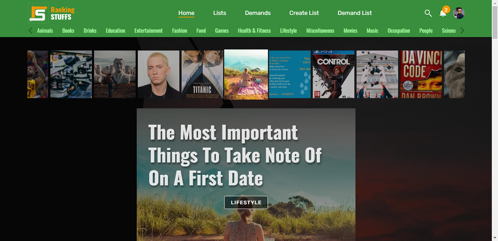


### Display Lists

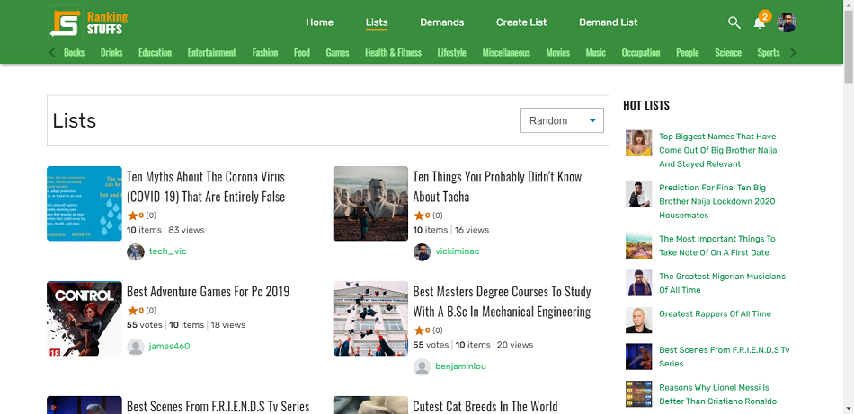


### List

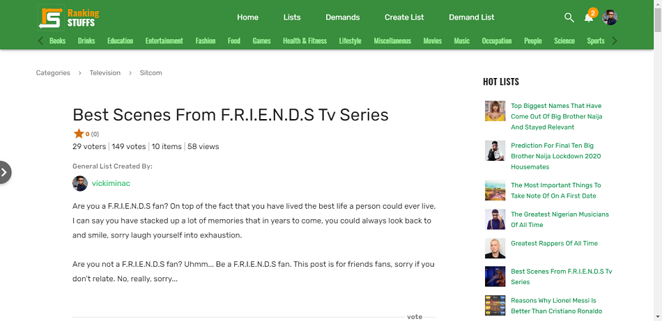


### List Item


### Display Demands

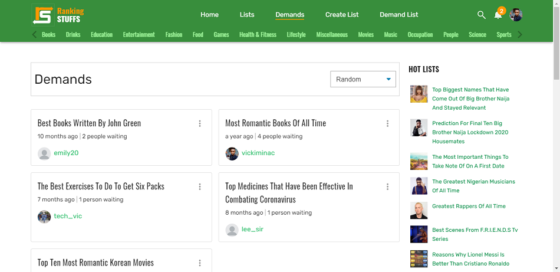


### Demand

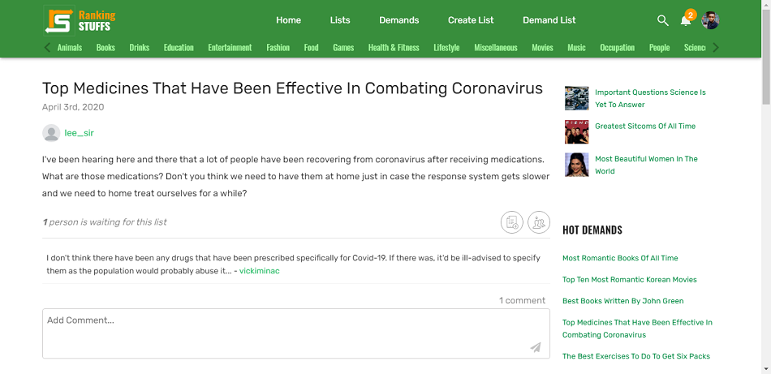


### Categories

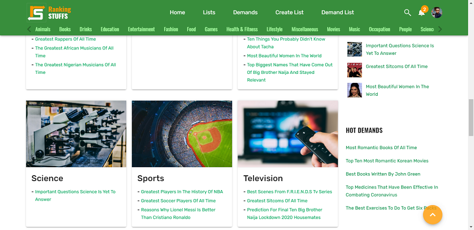


### Category

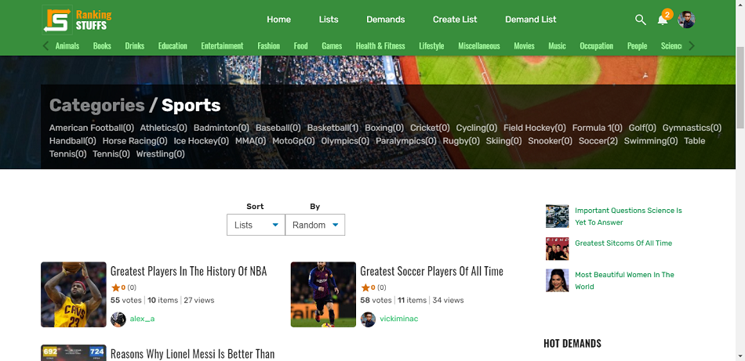


### SubCategory

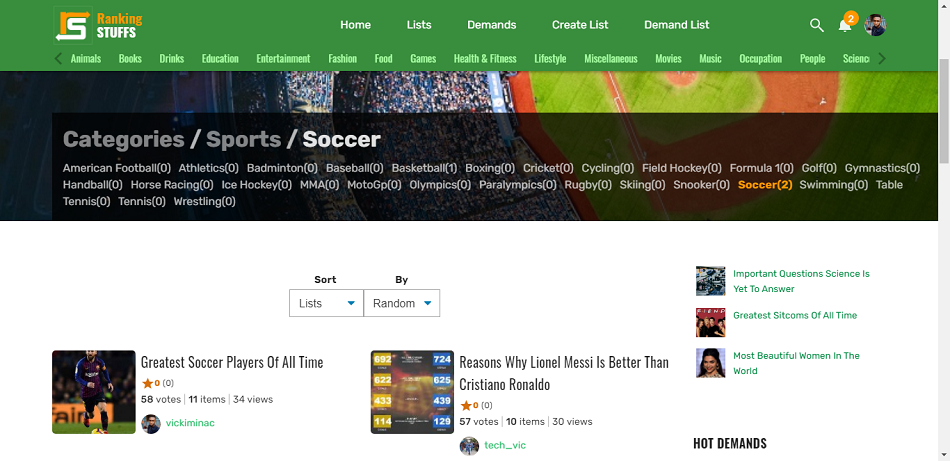


### Create List


### Demand List


### User Profile

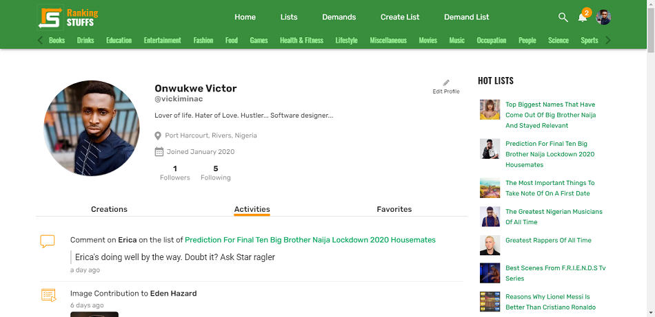


### User Favorites


### Search

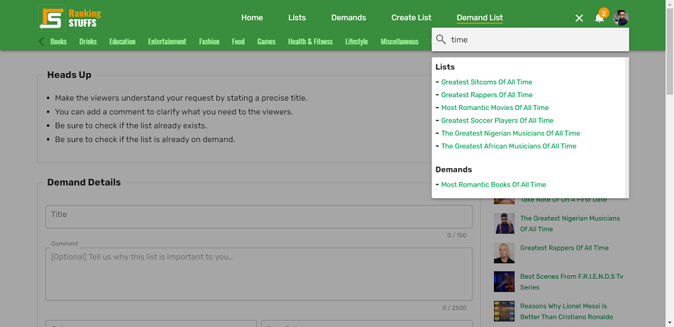


### Notifications

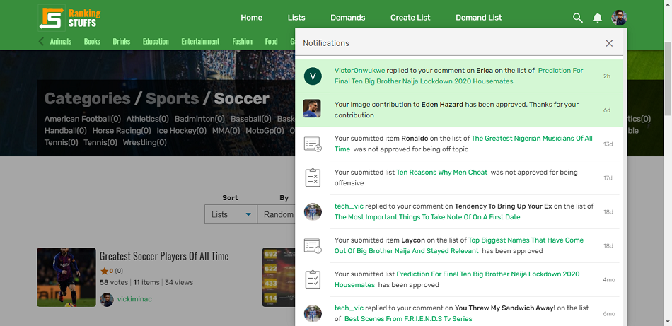


### User Preview


### Item

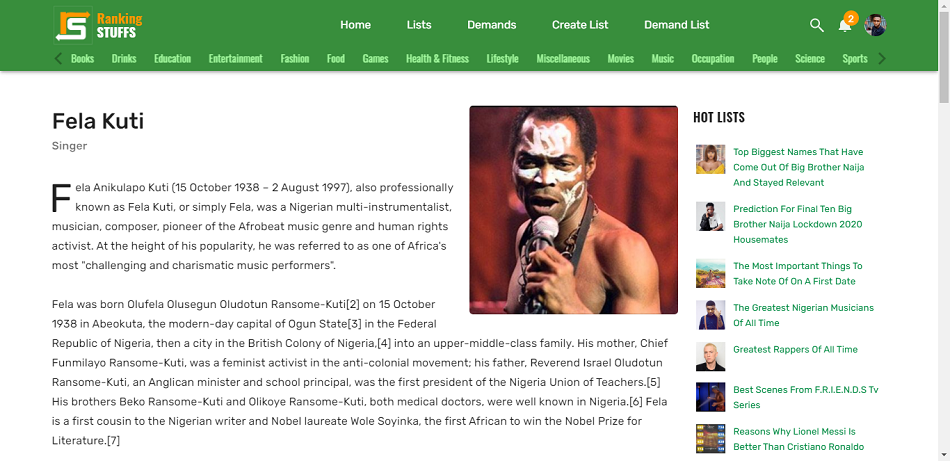